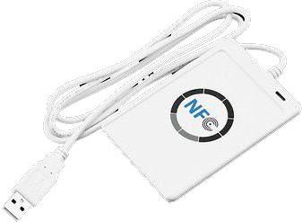
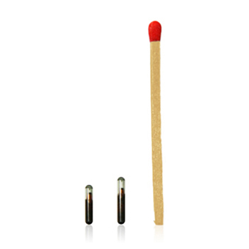

# RFID
## RFID SECURITY AND ENCRYPTION

| LANGUAGE | FILENAME         | MD5 HASH                         |
|------    |------            | -------                          |
| PDF      | Dissertation.pdf | 0f95941fd5ee3c4ab33d884eba05e521 |

- [x] Not to be reproduced in any form without the express written permission of the document owner.

This Staffordshire University 'Final Year Project’ (FYP) report particulars an investigation into the cyber security aspects of RFID systems, RFID smart cards and their associated variable encryption methods utilising the NFC ACR122U RFID contactless smart card reader & writer. 

Project planning was managed via Microsoft® project manager and as such this report also contains several software generated diagrams and charts produced by the project manager. It also contains the design rational and screen print of an academic project poster intended for Staffordshire University GradEX. 

In general this report comprehensively examines RFID solutions, RFID system architecture and their associated individual components via a qualitative research approach that has been adopted throughout the report. 

In specific the report covers an in-depth examination of RFID paraphernalia used within the security industry, RFID attack vectors and MiFare smart card decryption gathered via third party independent security research historically undertaken and presented at Black Hat summits and briefings across the World. 

__The report also features the laboratory controlled quantitative instance of an exemplar penetration test undertaken on a student issued 4k MiFare Classic smart card (RFID tag) being utilised by Staffordshire University as security access and authentication within their facilities.__
 
Finally, the report concludes with a best practice security policy which can be adopted and utilised within the security industry for guidance on RFID systems implementation.

### RFID TAG
 

